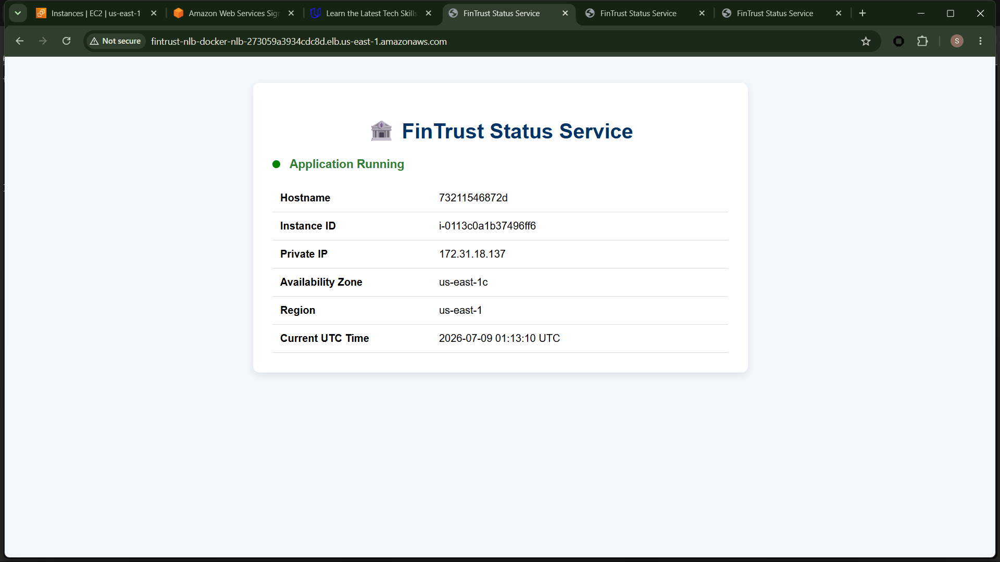
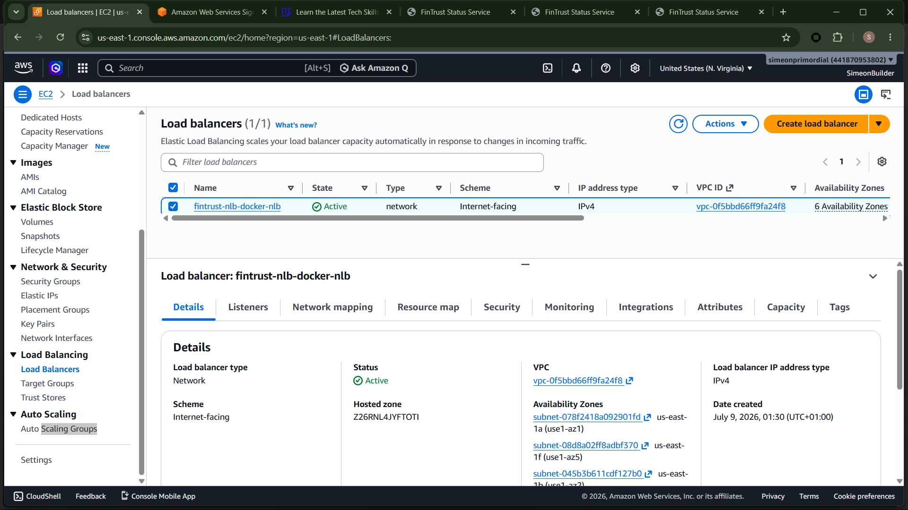
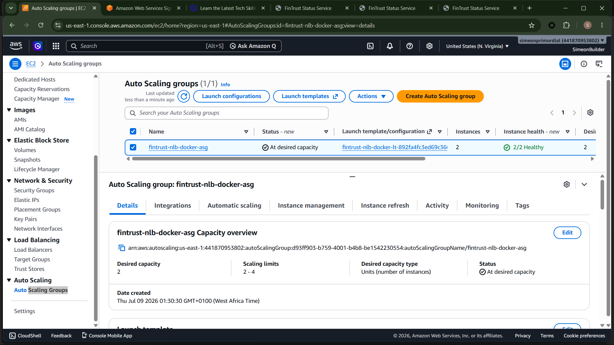
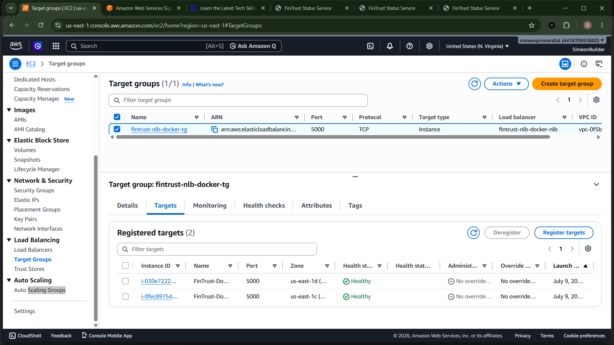

# FinTrust Status Service with Docker, Terraform & AWS


## Project Overview

FinTrust is a fictional financial technology company that requires a highly available and scalable status service for internal operations. The application is containerized with Docker and deployed on Amazon EC2 instances managed by an Auto Scaling Group behind a Network Load Balancer (NLB). All AWS infrastructure is provisioned using Terraform.

This project demonstrates Infrastructure as Code (IaC), containerization, automated provisioning, and highly available application deployment on AWS.

## Project Highlights

- Infrastructure provisioned entirely with Terraform
- Containerized Flask application using Docker
- Amazon EC2 Auto Scaling Group for high availability
- AWS Network Load Balancer for traffic distribution
- Health check endpoint for operational monitoring
- Infrastructure information endpoint powered by EC2 Instance Metadata (IMDSv2)
- Multi-AZ deployment using AWS Auto Scaling

---
##  Screenshots

### Application Dashboard



### Network Load Balancer



### Auto Scaling Group



### Target Group



---

# Business Problem

FinTrust requires a lightweight status service that can:

- Remain available even if an EC2 instance fails.
- Scale automatically with demand.
- Be deployed consistently using Infrastructure as Code.
- Be portable across environments using containers.
- Expose operational endpoints for health monitoring.

Manual server provisioning is slow, inconsistent, and difficult to maintain. The company therefore adopted Docker for application packaging and Terraform for automated AWS infrastructure provisioning.

---

# Project Objectives

- Containerize a Flask application using Docker.
- Deploy the application on EC2 instances.
- Automate infrastructure provisioning with Terraform.
- Deploy behind an AWS Network Load Balancer.
- Automatically replace unhealthy EC2 instances using an Auto Scaling Group.
- Demonstrate high availability across multiple Availability Zones.
- Expose operational endpoints for monitoring.

---

# Architecture

```
                    Internet
                        │
                        ▼
           Network Load Balancer (TCP:80)
                        │
                Target Group (TCP:5000)
                        │
              Auto Scaling Group (2–4 EC2)
               ┌──────────────┐
               │              │
          Docker Container  Docker Container
               │              │
           Flask App      Flask App
```

---

# AWS Services Used

| Service | Purpose |
|----------|----------|
| Amazon EC2 | Hosts Docker containers |
| Auto Scaling Group | Maintains desired EC2 capacity |
| Network Load Balancer | Distributes TCP traffic |
| Target Group | Registers healthy EC2 instances |
| Launch Template | Defines EC2 configuration |
| Security Groups | Controls inbound/outbound traffic |
| IAM | EC2 permissions |
| Default VPC | Networking |
| Terraform | Infrastructure as Code |

---

## 🏗 Architecture Decisions

### Why Docker?

Docker provides a consistent runtime environment, ensuring the application behaves the same during development, testing, and deployment.

### Why Terraform?

Terraform enables Infrastructure as Code (IaC), allowing AWS resources to be version-controlled, reproducible, and automatically provisioned.

### Why a Network Load Balancer?

This project exposes a containerized Flask application over TCP. An AWS Network Load Balancer was selected to demonstrate Layer 4 load balancing and prepare for future container-based workloads.

### Why Auto Scaling?

Auto Scaling improves availability by automatically replacing failed EC2 instances and maintaining the desired number of running instances.

# Docker Components

- Python 3.12 Slim Image
- Flask Application
- Dockerfile
- .dockerignore

Application exposed on:

5000/TCP

---

# Project Structure

```text
fintrust-nlb-docker/
│
├── app/
│   ├── app.py
│   ├── requirements.txt
│   ├── templates/
│   └── static/
│
├── docker/
│   └── Dockerfile
│
├── terraform/
│   ├── autoscaling.tf
│   ├── launch-template.tf
│   ├── networking.tf
│   ├── nlb.tf
│   ├── security.tf
│   ├── providers.tf
│   ├── variables.tf
│   ├── outputs.tf
│   └── userdata.sh
│
├── diagrams/
├── screenshots/
└── README.md
```

---

# Infrastructure Components

## Network Load Balancer

- Internet-facing
- TCP Listener (Port 80)
- Routes traffic to EC2 instances

## Target Group

Protocol:

TCP

Target Port:

5000

Health Check:

HTTP

Endpoint:

/health

---

## Auto Scaling Group

Desired Capacity:

2

Minimum:

2

Maximum:

4

Health Check:

ELB

---

## Launch Template

- Amazon Linux 2023
- Docker installed via User Data
- GitHub repository cloned
- Docker image built
- Container launched automatically

---

# Application Endpoints

| Endpoint | Purpose |
|-----------|----------|
| / | Dashboard |
| /health | Health Check |
| /info | Infrastructure Information |

---

# Deployment Workflow

1. Develop Flask application.
2. Build Docker image locally.
3. Test Docker container.
4. Push source code to GitHub.
5. Run Terraform.
6. Deploy AWS infrastructure.
7. Auto Scaling launches EC2 instances.
8. User Data installs Docker and starts the application.
9. Network Load Balancer routes traffic to healthy instances.

---

# Terraform Commands

```bash
terraform init

terraform fmt

terraform validate

terraform plan

terraform apply
```

Destroy infrastructure

```bash
terraform destroy
```

---

# Docker Commands

Build

```bash
docker build -f docker/Dockerfile -t fintrust-status-service:1.0 .
```

Run

```bash
docker run -d --name fintrust-app -p 5000:5000 fintrust-status-service:1.0
```

List Containers

```bash
docker ps
```

View Logs

```bash
docker logs fintrust-app
```

---

## 🧪 Testing

Local testing included:

- Flask application
- Docker container

AWS testing included:

- Auto Scaling deployment
- Network Load Balancer
- Target Group health checks
- HTTP endpoint validation
- Health endpoint validation
- Infrastructure information endpoint validation

---

# Validation

Successfully verified:

- Flask application
- Docker container
- EC2 Launch Template
- Auto Scaling Group
- Network Load Balancer
- Target Group Health Checks
- HTTP Dashboard
- Health Endpoint
- Infrastructure Endpoint

---

## 💰 Cost Considerations

This project was developed using AWS Free Tier–eligible services where possible.

Resources should be destroyed after testing:

terraform destroy

The primary cost-generating resources are:

- Network Load Balancer
- EC2 Instances
- Elastic Load Balancing data processing

Destroying the infrastructure prevents unnecessary charges.

---

# Screenshots

Include screenshots of:

- Terraform Apply
- Docker Build
- Docker Container
- EC2 Instances
- Launch Template
- Auto Scaling Group
- Network Load Balancer
- Target Group
- Application Dashboard
- Health Endpoint
- Info Endpoint

---

# Lessons Learned

- Infrastructure as Code simplifies repeatable deployments.
- Docker provides consistent runtime environments.
- Auto Scaling Groups automatically recover from failed EC2 launches.
- Network Load Balancers distribute traffic across healthy instances.
- EC2 Instance Metadata Service (IMDSv2) securely provides instance metadata.
- Operational endpoints such as `/health` and `/info` improve observability.

During deployment, the Auto Scaling Group initially failed to launch an EC2 instance because the selected Availability Zone (`us-east-1e`) temporarily lacked capacity for the requested `t3.micro` instance type. The ASG automatically retried the launch in another Availability Zone and successfully reached the desired capacity without manual intervention, demonstrating AWS Auto Scaling's self-healing capability.

---

## 🎓 Skills Demonstrated

- AWS Infrastructure as Code
- Terraform
- Docker
- Python
- Flask
- Linux
- EC2
- Launch Templates
- Auto Scaling Groups
- Network Load Balancers
- Health Checks
- Git
- GitHub
- Infrastructure Troubleshooting

---

# Future Improvements

- Store Docker images in Amazon ECR.
- Deploy containers using Amazon ECS.
- Implement CI/CD with GitHub Actions.
- Add HTTPS using AWS Certificate Manager.
- Add CloudWatch monitoring and alarms.
- Add centralized logging.
- Deploy into a custom VPC with public and private subnets.

---

#  Author

**Simeon**

Cloud Infrastructure Engineer

Currently mastering AWS through an 80-project roadmap focused on Infrastructure as Code, Containers, DevOps, Kubernetes, CI/CD, Observability, Security, and Production Cloud Architecture.
